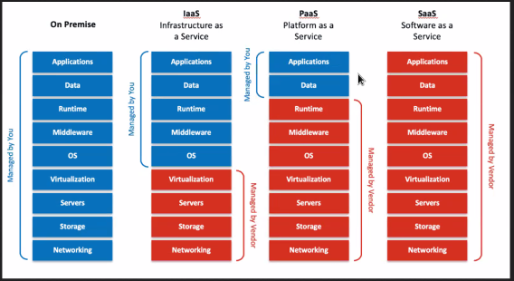

# Cómo limpiar un mate like a pro!
> Consejo del profesor de como limpiar el mate de calabaza, comúnmente llamado "porongo", cuando le crecen hongos.

## Paso 1:
Limpiar los hongos (hongo por hongo) vertiendo agua hirviendo y raspando con una cuchara el interior hasta que quede limpio.

## Paso 2:
Verter lavandina diluida en agua (1 parte de lavandina, 2 partes de agua) e intentar que esa mezcla haga contacto con todo el interior del mate. Luego enjuagar con agua.

## Paso 3:
Verter agua oxigenada dentro del mate, esto va a retirar el gusto a lavandina del mate y otros gustos no deseados. Luego enjuagar con agua.

## Paso 4:
Curar el mate. Esto se puede hacer sirviendo un mate como se hace normalmente y dejar estacionar de un día para otro. Al otro día se retira y descarta la yerba (no seas rata, tirala) y se seca el mate con una servilleta.  
Este paso se puede repetir 2 o 3 veces para mejorar el sabor del mate. Es recomendable secar bien el mate y luego dejar al sol por 1 o 2 horas entre cambio de yerba.
___

Ahora si, a lo que vinimos
# Mongoose
Cliente CLI: Consola
Cliente GLI: Interfaz Gráfica
Cliente web: interfaz gráfica en la web
Cliente app: interfaz gráfica para app

## Data Base as a Service DBaaS

La diferencia está en las tareas que delego al proveedor de Cloud.

- Infraestructura.
- Infraestructura y Plataforma.
- Infraestructura, Plataforma y Softwares.

A medida que nos acercamos a Software como servicio, perdemos control de modificaciones del proyecto.

## MongoDB Atlas

### Configuración de MongoDB Atlas

1. Crear una cuenta rellenando el formulario o ingresando con google.

2. Seleccionar el plan gratuito.

3. Crear un cluster para conectar a la base de datos.

### Configuración de Política de Seguridad

1. En el panel de la izquiera, clickeamos en "Network Access".

2. Clickeamos en " +ADD IP ADRESS".

3. Agregamos una IP genérica para que tome todas las IP. (0.0.0.0);

### Configuración de Acceso a la DB

1. Ingresamos en "Database Access" en el panel de la izquiera.

2. Editamos la configuración del usuario. Utilizamos el método "Password".

3. Configuramos la contraseña y asignamos el role de Atlas Admin para tener acceso total.

### Conectamos la base de datos.

1. Clickeamos en "Connect" al lado del nombre del Cluster.

2. Seleccionamos Drivers.

3. Copiamos el string de conección.

