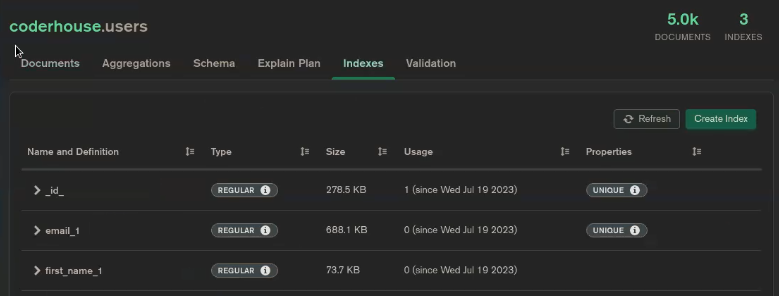

# Mongo Avanzado Parte 1

## Indexación
Recurso de mongo que nos permite realizar consultas de forma más rápida.  
Cada índice númerico se asocia a un documento, y nos dá la referencia para poder buscarlo de una forma más rápida, ahorrándonos tener que realizar toda la colección.  

### Archivos y dependencias
Para iniciar la práctica, contamos con un archivo de usuarios ubicado en './src/data/Users.json'.    
También vamos a contar con los archivos y carpetas de controllers, daos, db, middlewares, routes, services y server.js para poder hacer funcionar la app que maneja la base de datos.   
Además, debemos tener en cuenta que express, 

### users.model.js
Los campos indexados automáticamente son aquellos que cuentan con el atributo "unique: true".   
Tener en cuenta que "id" está indexado por defecto.
Para poder indexar un campo cuyos valores no son únicos (como id o email) debemos agregar el atributo "index: true" en su campo.

```javascript
import mongoose from 'mongoose';

const UserSchema = new mongoose.Schema({
  first_name: { 
    type: String, 
    required: true,
    index: true
  //aquí realizamos indexación de first_name.

  },
  last_name: { type: String, required: true },
  email:  { type: String, required: true, unique: true },
  //esta es una indexación automática por valor único.
  gender:  { type: String, required: true }
});

UserSchema.pre('find', function(){
  this.populate('pets')
})

export const UserModel = mongoose.model(
  'users',
  UserSchema
); 

```

### users.dao.js
En los métodos de nuestra clase de UserDaoMongoDB podremos realizar consultas por estos campos seleccionados.   
Para corroborar la indexación podemos utilizar el método ".explain()" que muestra por consola el tiempo que toma el proceso de carga de la consulta.

```javascript
import { UserModel } from "./models/user.model.js";

export default class UserDaoMongoDB {

  async getUserByName(name) {
    try {
      const response = await UserModel.find({first_name: name}).explain();
      return response.executionStats;
    } catch (error) {
      console.log(error);
    }
  }
//La búsqueda por campo "email" será más rápida que la búsqueda por "first_name", ya que "email" está indexado. 
  async getUserByEmail(email) {
    try {
      const response = await UserModel.find({email: email}).explain();
      return response.executionStats;
      //devolvemos la respuesta response.executionStats; ya que esto devuelve solo los datos de la búsqueda que nos interesan, con el fin de comparar los tiempos de carga.
    } catch (error) {
      console.log(error);
    }
  }

  async getAllUsers() {
    try {
      const response = await UserModel.find({}).explain();
      return response;
    } catch (error) {
      console.log(error);
    }
  }
}
```

Podemos corroborrar si los index están hechos en nuestro MongoDBCompass


## Populations
Esto implica obtener un documento referenciado dentro de otro documento en una sola búsqueda.   
Se almacena el id de un documento, como propiedad de otro documento. Esto se lo llama como "referencia".   
A través de id de referencia podremos llamar el documento referenciado completo.

### user.model.js
```javascript
import mongoose from 'mongoose';

const UserSchema = new mongoose.Schema({
  first_name: { 
    type: String, 
    required: true,
    index: true
  //aquí realizamos indexación de first_name.

  },
  last_name: { type: String, required: true },
  email:  { type: String, required: true, unique: true },
  //esta es una indexación automática por valor único.
  gender:  { type: String, required: true },
  pets: [
    {
      type: mongoose.Schema.Types.ObjectId,
      ref: 'pets',
      default: []
    }
  ]
  //Agregamos la population de "pets" dentro de los usuarios
});

UserSchema.pre('find', function(){
  this.populate('pets')
})

export const UserModel = mongoose.model(
  'users',
  UserSchema
); 

```

### pets.dao.js

Aquí vamos a agregar un método para agregar mascotas a los usuarios.

```javascript
export default class PetDaoMongoDB {

  async addPetToUser(userId, petId) {
    try {
      const user = await UserModel.findById(userId);
      user.pets.push(petId);
      user.save();
      return user;
    } catch (error) {
      console.log(error);
    }
  }
}
```

### pets.services.js
Agregamos el servicio relacionado con agregar mascotas a usuarios.

```javascript
import PetsDaoMongoDB from "../daos/mongodb/pets.dao.js";
const petsDao = new PetsDaoMongoDB();

export const addPetToUser = async(userId, petId) => {
  try {
    const exists = await petsDao.getPetById(petId);
    const newPetUser = await petsDao.addPetToUser(userId, petId);
    if(!exists) throw new Error('Pet not found');
    else return newPetUser;
  } catch (error) {
      console.log(error);
  } 
}
```

### users.dao.js
Para poder traer toda la información de la referencia, en el archivo de users.dao.js vamos a agregar el .populate('pets') a los métodos que muestran la información.

```javascript
async getUserById(id) {
    try {
      const response = await UserModel.findById(id).populate('pets');
      return response;
    } catch (error) {
      console.log(error);
    }
  }
```

## PRE
"Pre" es un middleware de mongoose que se ejecuta antes de finalizar el proceso de búsqueda y entrega de la respuesta agregando el populate a la misma. Esto nos ahorra tener que escribir el método populate() en cada método de la clase, en nuestro caso "users.model.js".

### users.model.js
Vamos a agregar el middleware "Pre" luego del schema definido.
Se le pasa el método en el cual se ejecuta el middleware ('find'). A este método se le agrega la función que va a llamar a this.populate('pets');   
Cada vez que se realice un metodo find, nos va a agregar el populate.   

```javascript
UserSchema.pre('find', function(){
    this.populate('pets')
})
```

> Este middleware se puede agregar para cualquier método de mongoose.   