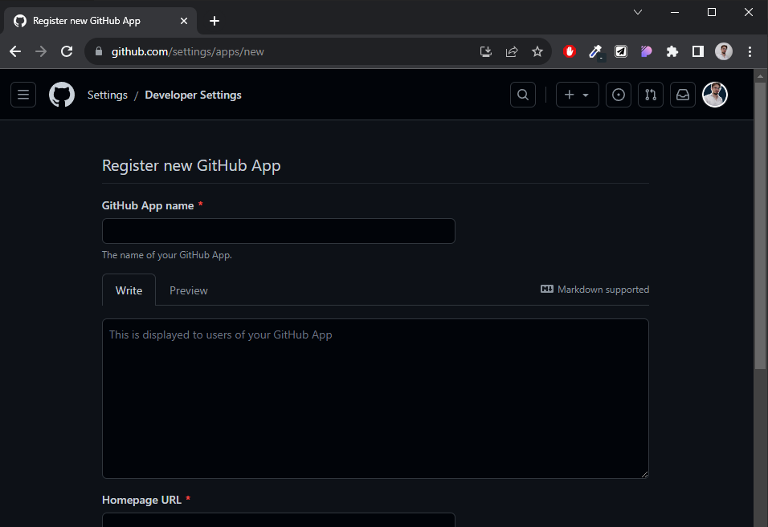

# Estrategia de Autenticación con Terceros + JWT
## Autenticación con GitHub
Ingresamos en nuestra cuenta de GitHub.  
Ingresamos en "Settings".  
  
Debajo de todo se encuentra "Developer Settings".  
Clickeamos en el bottón de "New GitHub App".
  

En esta interfaz vamos a configurar la app de github.
  

- Homepage URL: url de la homepage
- Callback URL: url a la que se redirige luego de autenticarse.
- Expire user authorization tokens (false);
- Request user authorization (OAuth) during installation (false).
- Enable Device Flow (false)

- Webhoook(false)

Permissions:
Nosotros vamos a solicitarle permiso sobre información al cliente.

Vamos a necesitar email e información de perfil.


Clickeamos en "Create GitHub App". Esto crea la app y nos llega a otra pantalla con información acerca de la app que creamos.

Luego damos en "Generate a new client secret" y esto nos da un secret key para cargarla en el sitio web.
___

## Github Strategy
### Instalamos passport-github2
```shell
npm i passport passport-github2
```

Creamos un nuevo archivo dentro de la carpeta "passport" llamado github-strategy.js para configurar la autenticación con github.


### github-strategy.js
```javascript
import { Strategy as GithubStrategy } from 'passport-github2';
import passport from 'passport';
import UserDao from '../daos/user.dao.js';
const userDao = new UserDao();

const strategyOptions = {
    clientID: 'Iv1.3c4696932577965e',
    clientSecret: '24d21d0a9d0c6c15880a55cc0ba3a6be18246129',
    callbackURL: 'http://localhost:8080/users/profile-github',
};

const registerOrLogin = async (accessToken, refreshToken, profile, done) => {
    // console.log('PROFILE --> ', profile);
    const email = profile._json.email !== null ? profile._json.email : profile_json.blog;
    const user = await userDao.getByEmail( email );
    if ( user ) return done( null, user );
    const newUser = await userDao.register({
        first_name: profile._json.name.split(' ')[0],
        last_name: profile._json.name.split(' ')[1],
        email,
        password: '',
        isGithub: true
    });
    return done(null, newUser);
}

//Inicializamos la estrategia de github.
passport.use('github', new GithubStrategy(strategyOptions, registerOrLogin));
```

### users.router.js
Creamos las rutas de autenticación con GitHub.

```javascript
router.get('/register-github', passport.authenticate('github', { scope: ['user:email'] }));
router.get('/profile-github', passport.authenticate('github', { scope: ['user:email'] }), githubResponse);
```

Debemos tener en cuenta que si utilizamos registro con autenticación de terceros, algunos datos de usuario que nosotros requerimos no serán retorandos por la API, como pueden ser: datos opcionales del usuario y contraseña.
Por este motivo, se recomienda realizar una collección y modelo a parte para los diferentes tipos de registro.
Una solución a la falta de contraseña, es generar una contraseña aleatoria que luego el usuario puede modificar a través de una autenticación por token.


### user.controllers.js
```javascript
export const githubResponse = async (req, res, next) => {
  try {
    const { first_name, last_name, email, isGithub } = req.user;
    res.json({
      msg: "Register/Login Github OK",
      session: req.session,
      userData: {
        first_name,
        last_name,
        email,
        isGithub,
      },
    });
  } catch (error) {
    next(error.message);
  }
};
```

### server.js
```javascript
import './passport/github-strategy.js';
```

### Middleware de Autenticación
Este se puede poner en cualquier ruta para verificar si el usuario está autenticado con passport. Retorna true or false.
```javascript
export const isAuth = (req,res,next) => {
    console.log(req.session.passport.user);
    console.log(req.isAuthenticated());
    if(req.isAuthenticated()) return next();
    res.status(401).send({ msg: 'Unauthorized' })
}
```
___

## Google Strategy
Deberemos registrarnos en Google Cloud, crear un nuevo proyecto e ir a la configuración en "API y servicios".
Configuramos pantalla de consentimiento
Vamos a configuración -> Credenciales y clickeamos en "crear credenciales" en ID de cliente de OAuth.
Aplicación Web
Nombre del cliente de consola

Originies autorizados de Javascript: http://localhost:8080/

URI de redireccionamiento autorizados: http://localhost:8080/users/oauth2/redirect/account.google.com


[Google Cloud](https://console.cloud.google.com)


### Instalación
```shell
npm i passport-google-oauth20
```

### google-strategy.js
```javascript
import { Strategy as GoogleStrategy } from 'passport-google-oauth20';
import passport from 'passport';
import UserDao from '../daos/user.dao.js';
const userDao = new UserDao();

const strategyOptions = {
    clientID: '1004164057773-dm0hme4tm2cvfpe9k78rfa7dhah4jb2n.apps.googleusercontent.com',
    clientSecret: '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',
    callbackURL: '/users/oauth2/redirect/accounts.google.com',
    scope: [ 'profile', 'email' ],
    state: true
};

const registerOrLogin = async (accessToken, refreshToken, profile, done) => {
    const email = profile._json.email;
    const user = await userDao.getByEmail( email );
    if ( user ) return done( null, user );
    const newUser = await userDao.register({
        first_name: profile._json.given_name,
        last_name: profile._json.family_name,
        email,
        password: '',
        isGoogle: true
    });
    return done(null, newUser);
};

passport.use('google', new GoogleStrategy(strategyOptions, registerOrLogin));

passport.serializeUser((user, done)=>{
    done(null, user);
});

passport.deserializeUser((id, done)=>{
    done(null, id);
});
```

### server.js
Importamos el passport de google
```javascript
import './passport/google-strategy.js';
```

### user.controllers.js
```javascript
export const googleResponse = async (req, res, next) => {
  try {
    // console.log(req.user)
    const { first_name, last_name, email, isGoogle } = req.user;
    res.json({
      msg: "Register/Login Google OK",
      session: req.session,
      userData: {
        first_name,
        last_name,
        email,
        isGoogle,
      },
    });
  } catch (error) {
    next(error.message);
  }
};
```

### users.router
```javascript
router.get('/oauth2/redirect/accounts.google.com', passport.authenticate('google', { assignProperty: 'user' }), googleResponse);
```

## Json Web Token
Es una alternativa de autenticación a guardar datos en session.
Se le envía un token con toda la inforamción encryptada del usuario desde el server al front. Cada vez que el fron realice una peticición, con la misma se enviará el token a través de los headers. El servidor verifica que el token es correcto y permite la interacción, caso contrario solicita una nueva verificación.  

### Instalación

```shell
npm i jsonwebtoken
```

### auth.js
Creamos una carpeta llamada "jwt" donde guardaremos el archivo auth.js

```javascript
import jwt from 'jsonwebtoken';

export const PRIVATE_KEY = '1234';

export const generateToken = ( user ) => {
    const payload = {
        userId: user._id,
        first_name: user.first_name,
        last_name: user.last_name,
        email: user.email,
        age: user.age
    };

    const token = jwt.sign(payload, PRIVATE_KEY, {
        expiresIn: '20m' //1h / 1m / 1s
    });

    return token;
};
```

### chekAuth.js
Middleware para verificar autenticación.

```javascript
import UserDao from "../daos/user.dao.js";
const userDao = new UserDao();
import jwt from "jsonwebtoken";
import { PRIVATE_KEY } from "../jwt/auth.js";

export const checkAuth = async (req, res, next) => {
  try {
    const authHeader = req.get("Authorization");
    if (!authHeader) res.status(401).json({ msg: "Unauthorized" });
    // El token llega de req como "Bearer b7kl2nwhgb9b64jky0bv2hbn486k7ob02"
    console.log(authHeader);

    //Para poder separar y eliminar del string "Bearer"...
    const token = authHeader.split(" ")[1];
    //Luego de tener el token lo decodificamos.
    const decode = jwt.verify(token, PRIVATE_KEY);
    const user = await userDao.getById(decode.userId);
    if (!user) res.status(401).json({ msg: "Unauthorized" });
    req.user = user;
    next();
  } catch (error) {
    next(error.message);
  }
};
```


